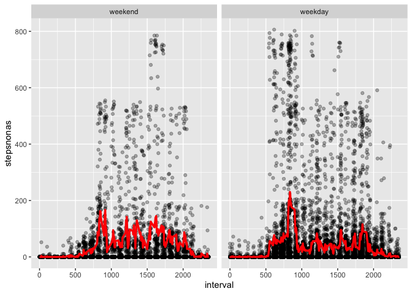

## Loading and preprocessing the data
Here is the R code to unzip and load the input data, and the displayof its summary.

```r
data0 <- read.csv(unzip("activity.zip"))
summary(data0)
```

```
##      steps                date          interval     
##  Min.   :  0.00   2012-10-01:  288   Min.   :   0.0  
##  1st Qu.:  0.00   2012-10-02:  288   1st Qu.: 588.8  
##  Median :  0.00   2012-10-03:  288   Median :1177.5  
##  Mean   : 37.38   2012-10-04:  288   Mean   :1177.5  
##  3rd Qu.: 12.00   2012-10-05:  288   3rd Qu.:1766.2  
##  Max.   :806.00   2012-10-06:  288   Max.   :2355.0  
##  NA's   :2304     (Other)   :15840
```
## What is mean total number of steps taken per day?
Here is the R code to compute the mean total number of steps per day, and its first 10-day output as well as the histogram.

```r
stepsperday <- tapply(data0$steps, data0$date, sum, na.rm = TRUE)
```

```
##            steps
## 2012-10-01     0
## 2012-10-02   126
## 2012-10-03 11352
## 2012-10-04 12116
## 2012-10-05 13294
## 2012-10-06 15420
## 2012-10-07 11015
## 2012-10-08     0
## 2012-10-09 12811
## 2012-10-10  9900
```
<!-- -->

Here is the R code to compute the daily mean and median of steps per day, and their first 10-day output.

```r
meanstepsperday <- tapply(data0$steps, data0$date, mean, na.rm = TRUE)
medianstepsperday <- tapply(data0$steps, data0$date, median, na.rm = TRUE)
head(data.frame("mean" = meanstepsperday, "median" = medianstepsperday), 10)
```

```
##                mean median
## 2012-10-01      NaN     NA
## 2012-10-02  0.43750      0
## 2012-10-03 39.41667      0
## 2012-10-04 42.06944      0
## 2012-10-05 46.15972      0
## 2012-10-06 53.54167      0
## 2012-10-07 38.24653      0
## 2012-10-08      NaN     NA
## 2012-10-09 44.48264      0
## 2012-10-10 34.37500      0
```

## What is the average daily activity pattern?
Here is the time series plot of steps in 5-minute intervals, averaged across the given two-month period, 2019-10-1 ~ 2012-11-30.
<!-- -->

From the graph or the calculation below,

```r
avgstepsperinterval[which.max(avgstepsperinterval)]
```

```
##      835 
## 206.1698
```
The maximum average steps across the two-month period occurs at interval 835 with 206.2 steps.

## Imputing missing values
In the data set, there are missing values n step counts, denoted by 'NA'.  There are:

```r
c("missing" = sum(is.na(data0$steps)), "total" = length(data0$steps))
```

```
## missing   total 
##    2304   17568
```
missing values (left) out of the total (right).

We fill in the missing values with the mean steps for the five-minute interval (calculated earlier).  

```r
#repeat avgstepsperinterval 61 days (=17568rows/288intervals)
repavgstepsperint <- rep(avgstepsperinterval, 61)
#create data0$stepsnonas as a copy of data0$steps
data0$stepsnonas <- data0$steps
#populate stepsnonas where na by the mean over 61 days, interval-wise.
data0$stepsnonas[which(is.na(data0$steps))] <- repavgstepsperint[which(is.na(data0$steps))]
#Confirm the result
c("missing_before" = sum(is.na(data0$steps)), "missing_after" = sum(is.na(data0$stepsnonas)))
```

```
## missing_before  missing_after 
##           2304              0
```
The histogram of the steps with filled missing values is as follows:

<!-- -->

Here is the R code for mean and median total number of steps taken per day.

```r
meanstepsperday2 <- tapply(data0$stepsnonas, data0$date, mean, na.rm = FALSE)
medianstepsperday2 <- tapply(data0$stepsnonas, data0$date, median, na.rm = FALSE)
```

Do these values differ from the estimates from the first part of the assignment?  What is the impact of imputing missing data on the estimates of the total daily number of steps?  Is thee graphs below, red dots are the imputed values.  There is more impact on the median than on the mean from the data imputing in this work.  This is because of the imputation method being the mean.

<!-- --><!-- -->

## Are there differences in activity patterns between weekdays and weekends?
We create a factor variable to determine if the given day is a weekday or not, as follows.


```r
data0$weekend <- weekdays(as.Date(data0$date)) %in% c("Saturday", "Sunday")
data0$weekend <- factor(data0$weekend, levels = c(TRUE, FALSE), labels = c("weekend", "weekday"))
```
We then calculate -- and plot the comparison of -- weekdays vs weekends 5-minute interval time series of steps, averaged over the two months, in red.


```r
g3 <- ggplot(data0, aes(x=interval, y=stepsnonas)) +
      geom_point(alpha=0.3) + facet_wrap(weekend ~. )
g3 + stat_summary(geom="line", size=1.2, fun.y="mean", colour = "red")
```

<!-- -->
